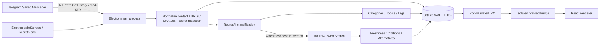

<p align="right">
  <a href="README.md">Русский</a> · <b>English</b>
</p>

# SavedAtlas

<p align="center">
  <b>Local AI organizer for Telegram Saved Messages on macOS</b><br />
  Read-only MTProto sync · SQLite/FTS5 · AI classification · Freshness checks · Source-aware review
</p>

<p align="center">
  <a href="https://www.electronjs.org/"></a>
  <a href="https://react.dev/"></a>
  <a href="https://www.typescriptlang.org/"></a>
  <a href="https://www.sqlite.org/"></a>
  <a href="https://core.telegram.org/mtproto"></a>
  
</p>

<p align="center">
  <a href="TECHNICAL.md"><b>Technical reference</b></a> ·
  <a href="ARCHITECTURE.md">Architecture</a> ·
  <a href="DATA_MODEL.md">Data model</a> ·
  <a href="PRIVACY.md">Privacy</a> ·
  <a href="TELEGRAM_SETUP.md">Telegram setup</a> ·
  <a href="ROUTERAI_SETUP.md">RouterAI setup</a>
</p>

## Overview

SavedAtlas is a local-first macOS desktop application for turning a large Telegram **Saved Messages** archive into a searchable, structured personal knowledge library. It authenticates as a user through MTProto, reads the owner's Saved Messages, normalizes and indexes the content locally, classifies records with RouterAI, groups them into topics and tags, and can verify time-sensitive material against web sources.

SavedAtlas is **not a Telegram bot**. The Telegram integration is a user MTProto client and the implemented synchronization path is read-only: the application fetches message history from peer `me` and does not implement send, edit, delete, forward, or reaction operations.

The project is designed around a clear privacy boundary: SQLite, notes, taxonomy and analysis history remain local; Telegram session data and API credentials are encrypted through Electron `safeStorage`; the renderer never receives decrypted secrets; and probable keys/tokens are redacted before AI analysis.

The previous detailed README has been preserved in **[TECHNICAL.md](TECHNICAL.md)**. This README presents the project as a portfolio/product overview while keeping the original operational documentation available.

## Product problem

Telegram Saved Messages often becomes an unstructured inbox rather than a usable knowledge base:

- useful links, courses, libraries, notes and documents accumulate in one chronological stream;
- older materials may become outdated without an obvious signal;
- searching by a remembered concept is harder than searching a classified topic or tag;
- manual organization is expensive when the archive is large;
- sending a complete private archive to an external AI service would be an unnecessary privacy risk;
- automatic classification should not silently overwrite deliberate user corrections.

SavedAtlas addresses this with local indexing, AI-assisted taxonomy, freshness checks only when needed, source-aware review, encrypted credentials and explicit protection for manual decisions.

## What this project demonstrates

- **Electron desktop architecture** with separate main, preload and React renderer boundaries, `contextIsolation`, disabled Node.js integration, sandboxing, navigation blocking and controlled external-link handling.
- **Real Telegram MTProto integration** using GramJS, phone/code authentication, optional 2FA password handling, saved-session reuse, paginated `messages.GetHistory` calls and flood-wait handling.
- **Local data engineering** with `better-sqlite3`, WAL mode, foreign keys, migrations, normalized relational tables, indexes and contentless FTS5 search.
- **Incremental content processing** with normalized text, extracted URLs, media typing, SHA-256 content hashes, duplicate/change detection and persisted synchronization checkpoints.
- **AI orchestration** through the OpenAI-compatible RouterAI endpoint for strict JSON classification and optional web-backed freshness checks.
- **Validated AI contracts** with Zod schemas for classification, freshness status, citations, credentials, IPC payloads and application state.
- **Privacy and secret handling** with macOS-backed Electron `safeStorage`, encrypted `secrets.enc`, file mode `0600`, secret redaction before AI calls and redacted technical logging.
- **Human-in-the-loop organization** with manual topic overrides, personal notes, review states and preservation of user decisions during later analysis.
- **Testing and delivery tooling** with ESLint, strict TypeScript checks, Vitest, Electron/Vite production builds, macOS GitHub Actions and arm64 DMG packaging.

## Screenshot

<p align="center">
  
</p>

## Architecture



The **main process** owns Telegram, RouterAI, SQLite, encrypted secrets, filesystem access and synchronization. The **preload layer** exposes a deliberately small typed API. The **React renderer** works only with validated application data and never receives raw Telegram credentials, RouterAI keys or decrypted session secrets.

## Main application areas

| Area | Path | Purpose |
|---|---|---|
| Desktop lifecycle | `src/main/index.ts` | Creates the hardened Electron window, opens external HTTPS links through the system browser, initializes database/secrets/services and registers IPC. |
| Local database | `src/main/database/` | SQLite schema, migrations, WAL/foreign-key setup, FTS5 index, demo data, taxonomy, search, analysis state and persistence. |
| Telegram integration | `src/main/services/telegram.ts` | GramJS client setup, user authorization, code/2FA flows, persisted StringSession and Saved Messages history retrieval. |
| Synchronization | `src/main/services/sync.ts` | Paginated read-only import, message/media normalization, checkpoints, pause/cancel state and pending-analysis execution. |
| AI analysis | `src/main/services/analysis.ts`, `routerai.ts` | Classification queue, RouterAI calls, topic creation/reuse, strict response parsing and conditional freshness checks. |
| Content safety | `src/main/services/content.ts`, `security.ts` | Text normalization, URL extraction, SHA-256 hashes, secret redaction, topic normalization, encrypted credential storage and log redaction. |
| IPC contracts | `src/shared/contracts.ts`, `src/main/ipc.ts` | Zod schemas, typed renderer API, validated search/settings/auth/note/topic payloads and controlled actions. |
| Renderer | `src/renderer/` | Russian desktop UI for dashboard, library, search, topics, review, freshness state, details, notes, setup and settings. |
| Tests | `tests/` | Content utilities, database/migrations/FTS/demo behavior and Telegram synchronization tests. |

## Core workflows

### Read-only Telegram synchronization

SavedAtlas configures a GramJS `TelegramClient` with a `StringSession`. The first-run flow supports phone number, Telegram login code and optional two-step verification password. The session string is encrypted locally after authorization.

Synchronization calls `messages.GetHistory` for peer `me`. Messages are imported in pages of up to 100 records. The database stores the Telegram message ID, dates, text, media type, source metadata, normalized content and content hash. Sync state is checkpointed so a long import can be continued safely.

The synchronization implementation is intentionally read-only. There are no application methods for sending, editing, deleting, forwarding or reacting to Telegram messages.

### Local normalization and indexing

Before external analysis, the application:

- normalizes whitespace and text/caption content;
- extracts unique HTTP/HTTPS URLs;
- identifies coarse media type such as photo, PDF, audio, video or document;
- computes an NFC-normalized SHA-256 content hash;
- stores source and raw-message metadata locally;
- indexes searchable fields through contentless SQLite FTS5.

SQLite runs in **WAL mode** with foreign keys enabled. The schema separates messages, categories, topics, tags, analysis results, freshness results, manual overrides, notes, sync state, analysis jobs, usage events and application settings.

### AI classification

RouterAI is accessed through the official OpenAI JavaScript client with the OpenAI-compatible base URL `https://routerai.ru/api/v1`. Classification is deterministic-oriented (`temperature: 0`) and requests a JSON object.

The model receives one normalized message plus available categories/topics. Before transmission, likely API keys, bearer tokens, passwords and similar secret patterns are replaced with `[СКРЫТО]`. The response must satisfy the Zod `classificationResponseSchema`, including category/topic suggestions, up to three tags, language, confidence, review state and freshness metadata.

A failed message does not terminate the whole analysis batch: the individual item is marked failed with redacted diagnostics and processing continues.

### Freshness verification

Freshness checking is conditional rather than applied blindly to every saved item. The local heuristic targets material that is likely to change over time, such as services, applications, libraries, frameworks, models, releases, courses, events, vacancies, prices, laws and external URLs, while obvious evergreen notes can remain outside the web-check path.

When classification requests a freshness check, RouterAI is called with its web plugin enabled. The search prompt prioritizes official websites, documentation, repositories and release notes. The validated response can represent `current`, `outdated`, `superseded`, `unavailable`, `evergreen` or `uncertain` and stores a verdict, reason, confidence, citations, alternatives and a recommended recheck interval.

### Manual decisions

The user can reassign a message to another topic and save a personal note. Manual topic assignments are recorded separately and marked as user-overridden so later automated analysis does not silently replace the user's decision.

## Search, topics and review UX

The React workspace includes:

- dashboard counters for total materials, new items, outdated items and records requiring review;
- full library and review-oriented views;
- local search across saved content, summaries, sources, topics/categories and tags;
- freshness filters such as current, outdated, superseded and uncertain;
- two-level category → topic navigation;
- detail panel with original message, AI summary, topic, tags, freshness verdict, confidence and citations;
- source-opening actions only when a public URL is available;
- personal notes and manual topic changes;
- keyboard shortcuts including `⌘K`, `⌘,` and `Escape`.

Demo Mode seeds a separate local dataset with 20+ representative records, allowing the interface, search, topics, statuses and review flow to be explored without Telegram or RouterAI credentials.

## Security and privacy boundaries

| Layer | Sensitive access |
|---|---|
| Electron main | Telegram session/API credentials, RouterAI key, SQLite, filesystem |
| Preload | Explicit typed/validated IPC allowlist |
| React renderer | Validated data only; no Node.js integration or decrypted secrets |

Electron is configured with `contextIsolation: true`, `nodeIntegration: false`, `sandbox: true` and `webSecurity: true`. New windows are denied; HTTPS links are handed to the system browser; arbitrary renderer navigation is blocked.

Telegram API hash, RouterAI key and Telegram session are serialized into a separate encrypted file using Electron `safeStorage`. Writes use a temporary file and atomic rename, with restrictive file permissions. Login codes and 2FA passwords are not stored. Exported application data does not intentionally include credentials/session secrets.

See **[PRIVACY.md](PRIVACY.md)** for the dedicated privacy notes.

## Tech stack

| Layer | Technologies |
|---|---|
| Desktop runtime | Electron 36, electron-vite, electron-builder |
| Frontend | React 18, TypeScript 5.8, Vite 6, Lucide React |
| Local database | better-sqlite3, SQLite, WAL, FTS5 |
| Telegram | GramJS (`telegram`), MTProto, `StringSession`, `messages.GetHistory` |
| AI | RouterAI through OpenAI JS client, OpenAI-compatible Chat Completions, web plugin |
| Validation | Zod |
| Security | Electron `safeStorage`, sandbox, context isolation, CSP-oriented renderer policy, secret redaction |
| Testing / quality | Vitest, ESLint, strict TypeScript checks |
| CI | GitHub Actions on macOS 14, Node.js 20 |
| Packaging | electron-builder, unsigned macOS arm64 DMG |

## Repository structure

```text
SavedAtlas/
├── src/
│   ├── main/
│   │   ├── database/          # SQLite schema, migrations, repositories and demo data
│   │   ├── services/          # Telegram, sync, RouterAI, analysis, content and security
│   │   ├── index.ts           # Electron lifecycle and secure BrowserWindow
│   │   └── ipc.ts             # Validated IPC handlers
│   ├── preload/               # Isolated typed renderer bridge
│   ├── renderer/              # React desktop UI
│   └── shared/                # Zod contracts and shared TypeScript types
├── tests/                     # Content, database and synchronization tests
├── docs/                      # README screenshot
├── resources/                 # Application icon assets
├── ARCHITECTURE.md            # Architecture notes
├── DATA_MODEL.md              # SQLite model overview
├── PRIVACY.md                 # Privacy and data-boundary notes
├── TELEGRAM_SETUP.md          # Telegram credential/setup guide
├── ROUTERAI_SETUP.md          # RouterAI setup guide
├── DEVELOPMENT.md             # Development notes
├── PACKAGING.md               # Packaging notes
├── TROUBLESHOOTING.md         # Troubleshooting guide
├── TECHNICAL.md               # Preserved previous detailed README
└── package.json
```

## Quick start

### Requirements

- macOS 13+ on Apple Silicon
- Node.js 20+
- npm

For **Demo Mode**, no Telegram or RouterAI credentials are required.

```bash
git clone https://github.com/Leo0742/SavedAtlas.git
cd SavedAtlas
npm install
npm run dev
```

In the setup wizard, choose the demo-mode option to populate the local example library.

### Real Telegram data

For real synchronization, obtain `api_id` and `api_hash` from `my.telegram.org`, enter them in the setup wizard, authorize the user session with the Telegram code/2FA flow, then configure a RouterAI API key and the desired classification/freshness models.

Credentials are configured in the application rather than loaded from `.env` and are encrypted through Electron `safeStorage`.

## Main scripts

| Command | Purpose |
|---|---|
| `npm run dev` | Start Electron + Vite in development mode. |
| `npm run lint` | Run ESLint across main, preload and renderer code. |
| `npm run typecheck` | Run strict TypeScript checks for Node/Electron and web configs. |
| `npm test` | Run Vitest unit/integration tests. |
| `npm run build` | Build the production Electron/Vite bundle. |
| `npm run package:mac` | Build and package an unsigned arm64 macOS DMG into `release/`. |

A useful local verification sequence is:

```bash
npm run lint
npm run typecheck
npm test
npm run build
npm run package:mac
```

GitHub Actions runs `npm ci`, lint, typecheck, tests and the production build on macOS 14 with Node.js 20.

## Technical documentation

The previous README was intentionally preserved in **[TECHNICAL.md](TECHNICAL.md)** rather than discarded. It contains the original operational description, setup sequence, architecture/security notes, workflow details, test notes and known limitations.

Additional focused documents:

- **[ARCHITECTURE.md](ARCHITECTURE.md)** — process boundaries and sync/data flow;
- **[DATA_MODEL.md](DATA_MODEL.md)** — SQLite tables, indexes and FTS5 structure;
- **[PRIVACY.md](PRIVACY.md)** — local/external data boundaries and secret handling;
- **[TELEGRAM_SETUP.md](TELEGRAM_SETUP.md)** — Telegram API and login setup;
- **[ROUTERAI_SETUP.md](ROUTERAI_SETUP.md)** — RouterAI configuration;
- **[DEVELOPMENT.md](DEVELOPMENT.md)** — development workflow;
- **[PACKAGING.md](PACKAGING.md)** — macOS packaging notes;
- **[TROUBLESHOOTING.md](TROUBLESHOOTING.md)** — common failure modes.

## Known limitations

- Current macOS packaging is unsigned and not notarized without an Apple Developer certificate.
- The packaged target is arm64.
- Image/PDF/audio analysis can be represented in configuration/UI, but automatic multimodal workers are intentionally disabled in the current version.
- Telegram may introduce additional authorization flows that are not handled by the current wizard.
- Private sources do not receive invented public source URLs.

## Status

SavedAtlas is a working local-first desktop project with implemented MTProto Saved Messages import, SQLite/FTS5 persistence, AI-assisted classification, topic/tag organization, conditional web freshness checks, source citations, notes, manual overrides, encrypted credentials, demo data, automated tests and macOS packaging.

## Why it matters for review

For engineering reviewers, this project demonstrates practical work across:

- Electron main/preload/renderer architecture and desktop security boundaries;
- TypeScript/React UI development;
- real MTProto integration and user-authenticated Telegram workflows;
- relational data modelling, FTS search and local persistence;
- incremental synchronization and content hashing;
- AI API orchestration with strict response validation;
- human-in-the-loop classification and freshness verification;
- secret storage, redaction and privacy-oriented design;
- testing, CI and macOS desktop packaging.
