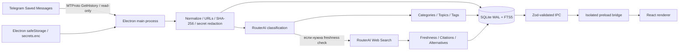

<p align="right">
  <b>Русский</b> · <a href="README.en.md">English</a>
</p>

# SavedAtlas

<p align="center">
  <b>Локальный AI-органайзер Telegram «Избранного» для macOS</b><br />
  Read-only MTProto sync · SQLite/FTS5 · AI-классификация · Freshness checks · Проверка по источникам
</p>

<p align="center">
  <a href="https://www.electronjs.org/"></a>
  <a href="https://react.dev/"></a>
  <a href="https://www.typescriptlang.org/"></a>
  <a href="https://www.sqlite.org/"></a>
  <a href="https://core.telegram.org/mtproto"></a>
  
</p>

<p align="center">
  <a href="TECHNICAL.md"><b>Техническая документация</b></a> ·
  <a href="ARCHITECTURE.md">Архитектура</a> ·
  <a href="DATA_MODEL.md">Модель данных</a> ·
  <a href="PRIVACY.md">Конфиденциальность</a> ·
  <a href="TELEGRAM_SETUP.md">Telegram setup</a> ·
  <a href="ROUTERAI_SETUP.md">RouterAI setup</a>
</p>

## Обзор

SavedAtlas — локальное macOS-приложение, которое превращает большой архив Telegram **«Избранного»** в структурированную и полнотекстово-поисковую личную библиотеку. Приложение авторизуется как пользователь через MTProto, читает сообщения из собственного Saved Messages, нормализует и индексирует их локально, классифицирует через RouterAI, распределяет по категориям, темам и тегам, а для зависящих от времени материалов может отдельно проверять актуальность по web-источникам.

SavedAtlas — **не Telegram-бот**. Интеграция реализована как пользовательский MTProto-клиент. Синхронизация вызывает `messages.GetHistory` для peer `me`; в коде нет операций отправки, редактирования, удаления, пересылки сообщений или реакций.

Архитектура построена вокруг явной privacy boundary: SQLite-база, темы, заметки и результаты анализа остаются на Mac; Telegram session и API credentials шифруются через Electron `safeStorage`; renderer не получает расшифрованные секреты; а перед AI-запросами вероятные ключи, токены, пароли и Authorization headers маскируются.

Предыдущий подробный README сохранён без потери технической информации в **[TECHNICAL.md](TECHNICAL.md)**. Этот README оформлен как основная витрина проекта, а исходная operational documentation остаётся доступна отдельно.

## Проблема продукта

Telegram «Избранное» со временем часто превращается не в базу знаний, а в длинную неструктурированную ленту:

- полезные ссылки, курсы, библиотеки, заметки и документы смешиваются в одном хронологическом потоке;
- старые материалы могут стать неактуальными, а пользователь этого не заметит;
- искать по смыслу и тематике сложнее, чем по уже назначенным категориям, темам и тегам;
- ручная классификация становится дорогой по времени на большом архиве;
- отправлять весь приватный архив во внешний AI-сервис было бы избыточно с точки зрения конфиденциальности;
- автоматическая классификация не должна молча перезаписывать ручные решения пользователя.

SavedAtlas решает это локальной индексацией, AI-assisted taxonomy, выборочной проверкой актуальности, источниками, шифрованием credentials и защитой ручных override-решений.

## Что демонстрирует проект

- **Electron desktop architecture** с разделением main / preload / React renderer, `contextIsolation`, отключённым Node.js integration, sandbox, запретом произвольной навигации и контролируемым открытием внешних ссылок.
- **Реальную Telegram MTProto-интеграцию** через GramJS: авторизация по телефону и коду, поддержка 2FA password, сохранение `StringSession`, пагинация `messages.GetHistory` и обработка `FLOOD_WAIT`.
- **Локальный data layer** на `better-sqlite3`: WAL mode, foreign keys, миграции, нормализованные таблицы, индексы и contentless FTS5.
- **Incremental content processing**: нормализация контента, извлечение URL, определение media type, SHA-256 `contentHash`, checkpoint синхронизации и повторный анализ только изменившихся/новых данных.
- **AI orchestration** через OpenAI-compatible RouterAI endpoint для строгой JSON-классификации и опциональной web-backed freshness проверки.
- **Валидацию AI и IPC контрактов** через Zod: classification, freshness statuses, citations, credentials, поисковые запросы, заметки, topic changes и application state.
- **Privacy/security engineering** через Electron `safeStorage`, отдельный `secrets.enc`, права `0600`, redaction секретов перед внешними запросами и sanitization технических логов.
- **Human-in-the-loop workflow**: ручное назначение темы, личные заметки, review states и сохранение пользовательских решений при последующем AI reanalysis.
- **Engineering quality**: ESLint, strict TypeScript typecheck, Vitest, production Electron/Vite build, GitHub Actions на macOS и упаковка arm64 DMG.

## Скриншот

<p align="center">
  
</p>

## Архитектура



**Main process** владеет Telegram-клиентом, RouterAI, SQLite, зашифрованными credentials, файловой системой и синхронизацией. **Preload** предоставляет ограниченный typed API. **React renderer** работает только с валидированными данными приложения и не получает Telegram API hash, RouterAI key или расшифрованную Telegram session.

## Основные модули

| Область | Путь | Назначение |
|---|---|---|
| Desktop lifecycle | `src/main/index.ts` | Secure `BrowserWindow`, инициализация database/secrets/services, controlled external links и IPC registration. |
| Database | `src/main/database/` | SQLite schema, migrations, WAL/foreign keys, FTS5, demo data, taxonomy, search, analysis state и persistence. |
| Telegram | `src/main/services/telegram.ts` | GramJS client, user auth, код/2FA, `StringSession` и чтение Saved Messages. |
| Sync | `src/main/services/sync.ts` | Пагинированный read-only import, media/source metadata, checkpoints, pause/cancel и запуск pending analysis. |
| AI analysis | `src/main/services/analysis.ts`, `routerai.ts` | Classification queue, RouterAI, topic creation/reuse, strict parsing и conditional freshness checks. |
| Content/security | `src/main/services/content.ts`, `security.ts` | Normalize, URL extraction, SHA-256, secret masking, topic normalization, safeStorage и log redaction. |
| Contracts / IPC | `src/shared/contracts.ts`, `src/main/ipc.ts` | Zod schemas, typed renderer API, validated auth/search/settings/note/topic actions. |
| Renderer | `src/renderer/` | Dashboard, библиотека, поиск, темы, review, freshness, details, setup и settings UI. |
| Tests | `tests/` | Content utilities, database/FTS/demo и Telegram synchronization tests. |

## Основные workflow

### Read-only Telegram synchronization

SavedAtlas создаёт GramJS `TelegramClient` с `StringSession`. Мастер первого запуска поддерживает номер телефона, Telegram login code и, если требуется, пароль двухэтапной проверки. После успешной авторизации session сохраняется в зашифрованном локальном хранилище.

Синхронизация вызывает `messages.GetHistory` для peer `me`. История читается страницами до 100 сообщений. Для каждой записи сохраняются Telegram ID, даты, текст, media type, source metadata, нормализованный контент и hash; состояние синхронизации хранит checkpoint для продолжения длинного импорта.

Реализованный путь принципиально read-only: нет методов, которые отправляют, редактируют, удаляют, пересылают Telegram-сообщения или ставят реакции.

### Локальная подготовка и индексация

Перед внешним AI-анализом приложение:

- нормализует whitespace и объединяет текст с caption;
- извлекает уникальные HTTP/HTTPS URL;
- определяет coarse media type: photo, PDF, audio, video, document или text;
- вычисляет SHA-256 hash по NFC-normalized content;
- сохраняет исходные source/raw metadata локально;
- индексирует доступные для поиска поля через contentless SQLite FTS5.

SQLite работает в **WAL mode** с включёнными foreign keys. Схема разделяет `messages`, `categories`, `topics`, `tags`, `message_analysis`, `freshness_analysis`, `manual_overrides`, `user_notes`, `sync_state`, `analysis_jobs`, `usage_events` и `app_settings`.

### RouterAI classification

RouterAI вызывается через официальный OpenAI JavaScript client с OpenAI-compatible `baseURL=https://routerai.ru/api/v1`. Для classification используется `temperature: 0` и ожидается JSON object.

Модель получает одно нормализованное сообщение и доступную taxonomy. До отправки вероятные API keys, bearer tokens, passwords и подобные patterns заменяются на `[СКРЫТО]`. Ответ обязан пройти `classificationResponseSchema`: category/topic, до трёх tags, language, confidence, `needs_review` и freshness metadata.

Ошибка одной записи не останавливает весь batch: сообщение получает failed state с redacted diagnostic, после чего очередь продолжает обработку остальных записей.

### Проверка актуальности

Freshness check запускается выборочно, а не для каждого сообщения. Локальная эвристика ищет материалы, которые действительно могут меняться: сервисы, приложения, библиотеки, frameworks, модели, релизы, курсы, события, вакансии, цены, законы и внешние URL. Явные evergreen-заметки могут не отправляться в web search.

Если классификатор запрашивает freshness check, RouterAI вызывается с web plugin. Search prompt отдаёт приоритет официальным сайтам, документации, repositories и release notes. Валидированный результат может иметь статус `current`, `outdated`, `superseded`, `unavailable`, `evergreen` или `uncertain` и сохраняет verdict, reason, confidence, citations, alternatives и период до следующей проверки.

### Ручные решения

Пользователь может вручную сменить тему и добавить личную заметку. Manual topic assignment записывается отдельно и помечается как `user_overridden`, чтобы последующий AI reanalysis не перезаписывал пользовательское решение без его участия.

## Поиск, темы и review UX

React workspace включает:

- dashboard counters для общего числа материалов, новых, устаревших и требующих проверки;
- отдельные режимы общей библиотеки и review;
- локальный поиск по сохранённому контенту, summaries, источникам, темам, категориям и тегам;
- freshness filters: актуально, устарело, есть альтернативы, требует проверки и другие состояния;
- двухуровневую структуру `Category → Topic`;
- detail panel с исходным сообщением, AI-сводкой, темой, тегами, freshness verdict, confidence и citations;
- открытие источника только когда доступен реальный публичный URL;
- личные заметки и ручное изменение темы;
- shortcuts `⌘K`, `⌘,` и `Escape`.

**Demo Mode** заполняет отдельную локальную базу 20+ репрезентативными примерами, поэтому интерфейс, темы, поиск и freshness/review workflow можно посмотреть без Telegram и RouterAI credentials.

## Security и privacy boundaries

| Слой | Чувствительный доступ |
|---|---|
| Electron main | Telegram session/API credentials, RouterAI key, SQLite, filesystem |
| Preload | Только явный typed/validated IPC allowlist |
| React renderer | Валидированные данные; без Node.js и decrypted secrets |

Electron запускается с `contextIsolation: true`, `nodeIntegration: false`, `sandbox: true`, `webSecurity: true`. Новые окна блокируются, внешние HTTPS-ссылки передаются системному браузеру, а произвольная renderer navigation запрещена.

Telegram API hash, RouterAI key и Telegram session сериализуются в отдельный encrypted file через Electron `safeStorage`. Запись идёт через temporary file + atomic rename с ограниченными file permissions. Login codes и 2FA password не сохраняются. Экспортированные данные приложения не должны включать credentials/session secrets.

Подробно: **[PRIVACY.md](PRIVACY.md)**.

## Tech stack

| Слой | Технологии |
|---|---|
| Desktop runtime | Electron 36, electron-vite, electron-builder |
| Frontend | React 18, TypeScript 5.8, Vite 6, Lucide React |
| Local database | better-sqlite3, SQLite, WAL, FTS5 |
| Telegram | GramJS (`telegram`), MTProto, `StringSession`, `messages.GetHistory` |
| AI | RouterAI через OpenAI JS client, OpenAI-compatible Chat Completions, web plugin |
| Validation | Zod |
| Security | Electron `safeStorage`, sandbox, context isolation, CSP-oriented renderer policy, secret redaction |
| Testing / quality | Vitest, ESLint, strict TypeScript checks |
| CI | GitHub Actions, macOS 14, Node.js 20 |
| Packaging | electron-builder, unsigned macOS arm64 DMG |

## Структура репозитория

```text
SavedAtlas/
├── src/
│   ├── main/
│   │   ├── database/          # SQLite schema, migrations, repositories и demo data
│   │   ├── services/          # Telegram, sync, RouterAI, analysis, content и security
│   │   ├── index.ts           # Electron lifecycle и secure BrowserWindow
│   │   └── ipc.ts             # Validated IPC handlers
│   ├── preload/               # Isolated typed renderer bridge
│   ├── renderer/              # React desktop UI
│   └── shared/                # Zod contracts и shared TypeScript types
├── tests/                     # Content, database и synchronization tests
├── docs/                      # Screenshot для README
├── resources/                 # Иконка приложения
├── ARCHITECTURE.md            # Архитектурные заметки
├── DATA_MODEL.md              # SQLite data model
├── PRIVACY.md                 # Privacy/data boundaries
├── TELEGRAM_SETUP.md          # Telegram setup
├── ROUTERAI_SETUP.md          # RouterAI setup
├── DEVELOPMENT.md             # Development notes
├── PACKAGING.md               # Packaging notes
├── TROUBLESHOOTING.md         # Troubleshooting
├── TECHNICAL.md               # Сохранённый предыдущий подробный README
└── package.json
```

## Быстрый старт

### Требования

- macOS 13+ на Apple Silicon
- Node.js 20+
- npm

Для **Demo Mode** Telegram и RouterAI credentials не нужны.

```bash
git clone https://github.com/Leo0742/SavedAtlas.git
cd SavedAtlas
npm install
npm run dev
```

В мастере первого запуска выберите demo mode — приложение заполнит локальную example-библиотеку.

### Реальные данные Telegram

Для реальной синхронизации получите `api_id` и `api_hash` на `my.telegram.org`, введите их в setup wizard, авторизуйте user session через Telegram code/2FA, затем настройте RouterAI API key и модели classification/freshness.

Credentials настраиваются внутри приложения, а не через `.env`, и сразу сохраняются через Electron `safeStorage`.

## Основные команды

| Команда | Назначение |
|---|---|
| `npm run dev` | Запустить Electron + Vite development mode. |
| `npm run lint` | ESLint для main, preload и renderer. |
| `npm run typecheck` | Strict TypeScript checks для Node/Electron и web configs. |
| `npm test` | Vitest unit/integration tests. |
| `npm run build` | Production Electron/Vite bundle. |
| `npm run package:mac` | Собрать unsigned arm64 macOS DMG в `release/`. |

Полная локальная verification sequence:

```bash
npm run lint
npm run typecheck
npm test
npm run build
npm run package:mac
```

GitHub Actions на macOS 14 с Node.js 20 запускает `npm ci`, lint, typecheck, tests и production build.

## Техническая документация

Предыдущий README намеренно сохранён в **[TECHNICAL.md](TECHNICAL.md)**, а не удалён. В нём остаются исходные operational instructions, setup sequence, architecture/security details, workflow notes, testing notes и known limitations.

Дополнительные документы:

- **[ARCHITECTURE.md](ARCHITECTURE.md)** — process boundaries и sync/data flow;
- **[DATA_MODEL.md](DATA_MODEL.md)** — SQLite tables, indexes и FTS5;
- **[PRIVACY.md](PRIVACY.md)** — local/external data boundaries и secret handling;
- **[TELEGRAM_SETUP.md](TELEGRAM_SETUP.md)** — Telegram API и login setup;
- **[ROUTERAI_SETUP.md](ROUTERAI_SETUP.md)** — RouterAI configuration;
- **[DEVELOPMENT.md](DEVELOPMENT.md)** — development workflow;
- **[PACKAGING.md](PACKAGING.md)** — macOS packaging;
- **[TROUBLESHOOTING.md](TROUBLESHOOTING.md)** — типовые проблемы.

## Известные ограничения

- Текущая macOS-сборка unsigned и не notarized без Apple Developer certificate.
- Packaging target — arm64.
- Image/PDF/audio analysis представлен в настройках/UI, но automatic multimodal workers в текущей версии намеренно отключены.
- Telegram может добавлять дополнительные сценарии авторизации, которые текущий wizard не обрабатывает.
- Для приватных источников приложение не создаёт выдуманные публичные URL.

## Статус

SavedAtlas — рабочий local-first desktop project с реализованным импортом Telegram Saved Messages через MTProto, SQLite/FTS5 persistence, AI-assisted classification, организацией по темам/тегам, conditional web freshness checks, citations, заметками, manual overrides, encrypted credentials, Demo Mode, automated tests и macOS packaging.

## Почему проект полезен для review

Для engineering/recruiter review проект показывает практическую работу с:

- Electron main/preload/renderer architecture и desktop security boundaries;
- TypeScript/React desktop UI;
- реальной MTProto-интеграцией и user-authenticated Telegram workflows;
- relational data modelling, FTS search и local persistence;
- incremental synchronization и content hashing;
- AI API orchestration со strict response validation;
- human-in-the-loop classification и freshness verification;
- secure secret storage, redaction и privacy-oriented design;
- testing, CI и упаковкой macOS desktop application.
