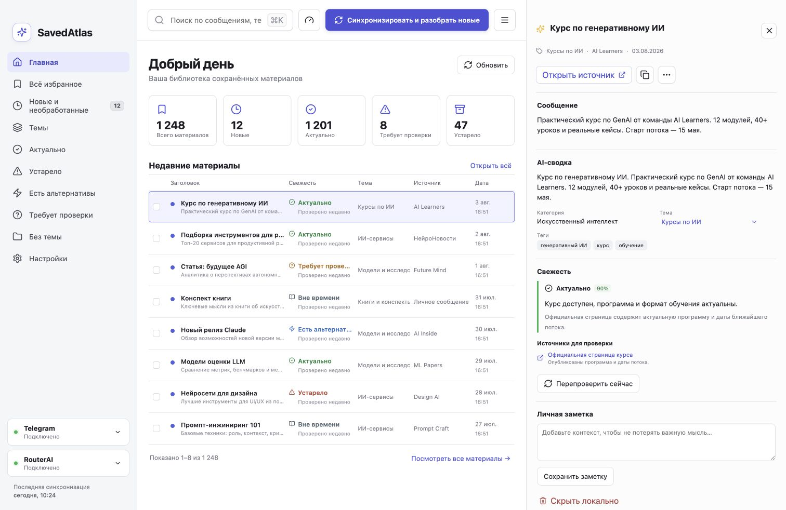
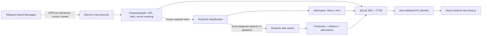

# SavedAtlas

SavedAtlas — локальный macOS‑органайзер для Telegram «Избранного». Он импортирует сообщения через пользовательский MTProto‑клиент, индексирует их в SQLite/FTS5, классифицирует через RouterAI и проверяет актуальность материалов с источниками. Автоматическое создание новых тем выключено по умолчанию и включается отдельно.

> Это не Telegram-бот. SavedAtlas авторизуется как пользовательский MTProto-клиент и работает с вашим личным чатом «Избранное» только на чтение.



## Требования

- macOS 13+ на Apple Silicon;
- Node.js 22.12+ и npm;
- для реального подключения: `api_id`/`api_hash` с [my.telegram.org](https://my.telegram.org) и обычный ключ RouterAI;
- Xcode Command Line Tools нужны для native rebuild `better-sqlite3` при создании DMG. Сертификат Apple Developer нужен только для подписи и нотарификации.

## Быстрый запуск в Demo Mode

```bash
git clone https://github.com/Leo0742/SavedAtlas.git
cd SavedAtlas
npm ci
npm run dev
```

В мастере первого запуска нажмите **«Сразу открыть демо-режим»**. Будет создана отдельная SQLite-база с 20+ примерами: курсы, библиотеки, сервисы, личные заметки, PDF, голосовые сообщения, дубликаты и устаревшие материалы. Telegram- и RouterAI-ключи для Demo Mode не нужны.

## Первый запуск с реальными данными

1. Получите `api_id` и `api_hash` на [my.telegram.org](https://my.telegram.org).
2. Запустите приложение командой `npm run dev`.
3. В мастере введите Telegram API credentials, номер телефона и код из Telegram.
4. Если включена двухэтапная проверка, введите облачный пароль.
5. Добавьте обычный RouterAI API key и выберите модели классификации/freshness.
6. Проверьте подключение и выберите допустимые типы анализа.
7. Нажмите **«Завершить и синхронизировать»**. Главное окно откроется после локального импорта; очередь анализа продолжит работу в фоне.

Credentials не читаются из `.env`: они вводятся только в приложении и сразу шифруются через macOS-backed Electron `safeStorage`. После настройки удалить их можно отдельно в **Настройки → Telegram** и **Настройки → RouterAI**.

Если найдена база прототипа с неподдерживаемой схемой, приложение не изменяет её: SQLite, WAL и SHM переносятся в `savedatlas-prototype-backup-<timestamp>.sqlite`, после чего создаётся чистая production-схема. Архив можно показать в Finder или явно удалить в **Настройки → Данные**. Demo Mode использует отдельный `savedatlas-demo.sqlite` и не меняет реальную базу, checkpoint, очередь или credentials.

## Команды

Проверка и сборка:

```bash
npm run lint
npm run typecheck
npm test
npm run build
npm run package:mac
npm run test:e2e:packaged
```

| Команда | Назначение |
|---|---|
| `npm run dev` | Electron + Vite в режиме разработки |
| `npm run lint` | ESLint для main, preload и renderer |
| `npm run typecheck` | строгая проверка TypeScript |
| `npm test` | unit/integration тесты Vitest |
| `npm run build` | production bundle Electron/Vite |
| `npm run package:mac` | unsigned arm64 DMG в `release/` |
| `npm run test:e2e:packaged` | mocked first-run и global-search E2E внутри собранного `.app` |

При первом запуске откроется мастер настройки. Можно выбрать «Сразу открыть демо-режим»: в отдельную локальную базу будут добавлены 20+ примеров, и реальные ключи не потребуются. Telegram и RouterAI настраиваются в приложении: **Настройки → Telegram / RouterAI**. Значения шифруются через Electron `safeStorage` и не сохраняются в исходном коде, `.env`, SQLite или renderer state.

## Возможности

- полноэкранный мастер настройки и MTProto‑вход с кодом/2FA;
- полная и инкрементальная пагинация «Избранного» с checkpoint;
- SQLite WAL, миграции, FTS5, защита ручных решений;
- 20+ демонстрационных сообщений, темы, глобальный поиск с пагинацией, фильтры, детали, источники и заметки;
- RouterAI classification и web freshness через `https://routerai.ru/api/v1`;
- маскирование вероятных секретов перед AI‑запросом;
- JSON‑экспорт без credentials/session;
- изолированный preload API, Zod‑валидация IPC и CSP;
- русский интерфейс, клавиши `⌘K`, `⌘,`, `Escape`.

## Как это работает



### 1. Синхронизация Telegram

Main process вызывает реальный GramJS `messages.GetHistory` для peer `me`. История читается страницами по 100 сообщений; после каждой страницы сохраняется checkpoint. При следующем запуске приложение повторно проверяет небольшой overlap, сравнивает `contentHash` и отправляет в анализ только новые или изменённые записи.

Приложение не содержит вызовов отправки, редактирования, удаления, пересылки или реакций. Если публичную ссылку на источник построить нельзя, UI её не выдумывает.

### 2. Локальная подготовка

До внешнего AI-запроса SavedAtlas:

- объединяет текст и подпись, сохраняя оригинал отдельно;
- извлекает URL и тип вложения;
- вычисляет SHA-256 hash для incremental sync и duplicate detection;
- маскирует вероятные API keys, токены, passwords и Authorization headers;
- записывает сообщение и очередь в SQLite transaction.

### 3. Классификация RouterAI

RouterAI получает одно сообщение, доступные категории/темы и строгую JSON-схему. Ответ проходит Zod validation, локальный JSON repair и до двух повторных model attempts. Сервис переиспользует существующие и семантически близкие темы. Новая тема создаётся только если пользователь включил автоматическое создание, confidence выше порога и ответ не требует review. Ошибка одного сообщения не останавливает очередь.

### 4. Проверка актуальности

Freshness включается только для материалов, которые могут меняться: сервисов, библиотек, курсов, событий, цен, вакансий, законов и внешних URL. RouterAI web plugin ищет прежде всего официальные страницы, документацию, GitHub и release notes. Результат хранит статус, объяснение, confidence, дату истечения cache и citations.

Возраст Telegram-сообщения сам по себе не делает материал устаревшим. Теория, личные заметки и фундаментальные статьи могут получить статус `evergreen` без web search.

### 5. Ручные решения

Пользователь может сменить тему, добавить заметку и исправить AI-решение. Такая запись получает `user_overridden`; последующий reanalysis сохраняет ручное решение и лишь записывает новую AI-рекомендацию в историю.

## Архитектура безопасности

| Слой | Доступ |
|---|---|
| Electron main | Telegram session, RouterAI key, SQLite, файловая система |
| Preload | фиксированный типизированный IPC allowlist |
| React renderer | только валидированные данные, без Node.js и decrypted secrets |

Основные настройки Electron: `contextIsolation: true`, `nodeIntegration: false`, sandbox, строгая CSP, блокировка произвольной навигации и контролируемое открытие внешних HTTPS-ссылок.

Локальные данные находятся в стандартном `app.getPath("userData")`. Telegram session и RouterAI key хранятся в отдельном зашифрованном файле; они не попадают в SQLite, exports, backups, renderer state или логи.

## Структура проекта

```text
src/
  main/
    database/       SQLite schema, migrations, repositories, demo data
    services/       Telegram, sync, RouterAI, analysis, security
    index.ts        secure Electron window
    ipc.ts          validated IPC handlers
  preload/          isolated typed API
  renderer/         Russian React interface
  shared/           Zod contracts and shared types
tests/              unit, database, sync, queue, metadata and React tests
e2e/                packaged Electron/Playwright test
docs/               screenshots and design concept
resources/          original SavedAtlas icon
```

## Тестирование

Тесты не требуют реальных credentials. Они покрывают:

- нормализацию, URL extraction, SHA-256 hash и secret redaction;
- strict classification/freshness schemas и JSON repair;
- SQLite migrations, FTS5 и Demo Mode;
- full/incremental pagination на 250+ сообщениях, resume, overlap, duplicate pages и FloodWait;
- защиту ручной темы от reanalysis;
- cache invalidation, фактическое job recovery/drain и экспорт без секретов;
- глобальный FTS за пределами первых 50 и reindex после classification/note/topic;
- React first-run workflow и packaged Electron first-run/search workflow.

Локальная проверка corrective pass: **41 Vitest tests + 2 packaged Playwright E2E**, lint, typecheck, production build и unsigned arm64 packaging. Это не утверждение о GitHub Actions: статус CI следует проверять в pull request.

## Конфиденциальность

Telegram используется только на чтение: приложение не вызывает операции отправки, изменения, удаления, пересылки или реакций. Текст отправляется в RouterAI только для запрошенного анализа и после маскирования вероятных ключей и токенов. Подробности: [PRIVACY.md](PRIVACY.md).

## Известные ограничения

- подпись и нотарификация не выполняются без Apple Developer certificate;
- AI-анализ изображений/PDF/аудио не реализован: сохраняются Telegram-метаданные, анализируются только текст и подпись, media jobs не создаются;
- второй карточный вид намеренно отсутствует;
- тема интерфейса применяется после перезапуска; unsigned DMG не проходит Gatekeeper как notarized release;
- Telegram иногда меняет дополнительные сценарии входа (например, email‑подтверждение); в таком случае мастер показывает безопасную ошибку и позволяет повторить вход;
- приватные источники не получают выдуманные публичные ссылки.

Дополнительные документы: [архитектура](ARCHITECTURE.md), [модель данных](DATA_MODEL.md), [Telegram](TELEGRAM_SETUP.md), [RouterAI](ROUTERAI_SETUP.md), [разработка](DEVELOPMENT.md), [упаковка](PACKAGING.md), [решение проблем](TROUBLESHOOTING.md).
